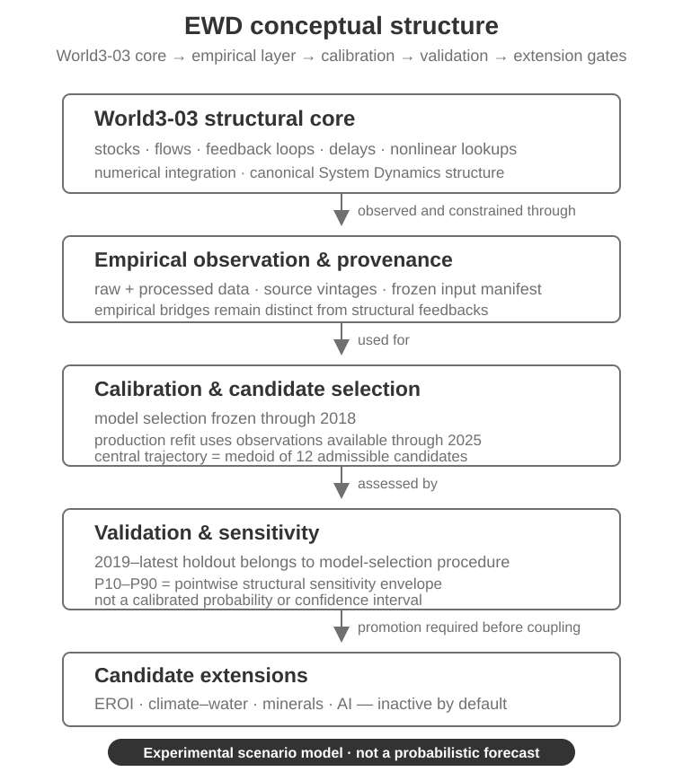

  

<h2 align="center">Empirical World3 Dynamics (EWD)</h2>

  
  
  

<small><strong>An empirical System Dynamics model that combines the World3-03 structural core with observed data, reproducible calibration artifacts, validation checks and explicit provenance.</strong></small>

<small>
<a href="#what-is-ewd">Overview</a> ·
<a href="#model-at-a-glance">Model structure</a> ·
<a href="#scientific-status-at-a-glance">Scientific status</a> ·
<a href="#reproduce-the-retained-scientific-baseline">Reproduce</a> ·
<a href="#data-and-provenance">Data & provenance</a> ·
<a href="#documentation">Documentation</a>
</small>

---

### What is EWD?

Empirical World3 Dynamics (EWD) is a scientific model core for examining the behavior of the World3-03 System Dynamics structure alongside observed data, retained calibration artifacts, backtests, sensitivity diagnostics and explicit source provenance.

The **World3-03 structure remains the model core**: stocks, flows, feedback loops, delays, nonlinear lookup functions and numerical integration. EWD adds a separate empirical layer for observation, calibration, candidate selection and validation. That empirical layer can test or constrain parts of the model, but it does not silently redefine the World3 structure or imply that every feedback has been empirically validated.

The retained central model is an **experimental scenario model, not a probabilistic forecast**.

### Model at a glance

| Dimension | EWD boundary |
| --- | --- |
| Canonical paradigm | Empirical System Dynamics based on the World3-03 structural core |
| Structural core | Stocks, flows, feedback loops, delays, nonlinear lookup functions, numerical integration |
| Empirical layer | Observed source/processed data, calibration, selection, validation and provenance |
| Model selection | Frozen through 2018 |
| Production trajectory | Separate refit using observations available through 2025 |
| Central trajectory | Medoid of 12 admissible production candidates |
| Sensitivity range | Pointwise P10-P90 structural sensitivity envelope |
| Candidate extensions | Inactive unless explicit promotion gates pass |
| Current public release | **v0.1.0 scientific-core baseline** |

  <picture>
    <source media="(prefers-color-scheme: dark)" srcset="assets/readme/ewd-concept-overview-dark.svg">
    <source media="(prefers-color-scheme: light)" srcset="assets/readme/ewd-concept-overview-light.svg">
    
  </picture>

This is an orientation figure, not a complete stock-flow or causal-loop diagram. Exact equations, lookup functions, parameterization and scenario definitions remain in the scientific model files.

### How EWD is structured

| Layer | Role | Interpretation boundary |
| --- | --- | --- |
| **World3-03 structural core** | Defines the System Dynamics stocks, flows, feedbacks, delays and integration | Canonical structural model |
| **Empirical observation & provenance** | Links observed sources and retained processed data to measurable model quantities | Observation does not automatically validate structure |
| **Calibration & candidate selection** | Fits/selects admissible parameter/model candidates under declared procedures | Model selection is frozen through 2018 |
| **Validation & sensitivity** | Evaluates retained candidates, holdouts and structural sensitivity | Sensitivity envelopes are not probability intervals |
| **Candidate extensions** | EROI, climate-water, minerals, AI and other externally motivated mechanisms | Inactive unless explicit promotion gates pass |

### Scientific status at a glance

| Scientific dimension | Current state |
| --- | --- |
| World3-03 structural core | **Canonical / retained** |
| Public scientific-core release | **v0.1.0** |
| Model selection data boundary | **Through 2018** |
| Displayed production refit | **Uses observations available through 2025** |
| Retained production candidates | **12 admissible** |
| Central trajectory selection | **Trajectory medoid** |
| 2019-latest holdout | **Part of model-selection procedure** |
| P10-P90 range | **Structural sensitivity envelope, not probability** |
| Candidate extensions | **Inactive** |
| Parameter identification | **Several parameters remain weakly identified** |

The displayed production trajectory is therefore **not** itself an independent holdout forecast. Several structural parameters remain weakly identified, including resources, industrial output ratio, industrial capital lifetime, land yield, pollution generation and pollution assimilation.

For the exact current scientific boundary, see [STATUS.md](STATUS.md).

### What EWD establishes — and what it does not

**EWD currently provides:**

- a retained World3-03 System Dynamics structural core;
- observed and processed empirical datasets with provenance;
- reproducible calibration and candidate-selection artifacts;
- retained backtest/validation outputs;
- fit and parameter-identifiability diagnostics;
- explicit sensitivity envelopes and extension promotion gates;
- a reproducibility workflow for frozen scientific artifacts.

**EWD does not currently claim:**

- a probabilistic forecast of global outcomes;
- calibrated probabilities for scenario trajectories or turning points;
- complete parameter identifiability;
- empirical validation of every latent World3 state or feedback;
- that the P10-P90 envelope is a confidence interval;
- central activation of EROI, climate-water, minerals, AI or other candidate extensions;
- an end-user decision or policy system.

### Reproduce the retained scientific baseline

The canonical GitHub workflow uses **Python 3.12** and a pinned uv environment.

~~~bash
python3 scripts/generate_science_input_manifest.py
git diff --exit-code -- science/data/input_manifest.json

uv run --locked --project science --extra world3-03 \
  python scripts/reproduce_scientific_results.py

uv run --locked --project science --extra world3-03 \
  python science/scripts/evaluate_direct_emissions_prospective.py --check
~~~

A successful run verifies that the frozen input manifest and retained reproducible scientific artifacts remain consistent with the repository. It does **not** transform the central scenario into a probabilistic forecast or establish complete empirical identification of the World3 structure.

See [.github/workflows/science-reproducibility.yml](.github/workflows/science-reproducibility.yml) for the canonical automated path.

### Data and provenance

EWD treats empirical inputs and provenance as a distinct scientific layer.

~~~text
source / retained raw input
            ↓
processed empirical series
            ↓
frozen input manifest + provenance
            ↓
calibration / candidate selection
            ↓
validation, diagnostics and retained scenario artifacts
~~~

The current frozen scientific-input manifest uses SHA-256 hashes and covers retained raw/processed inputs plus the World3-03 source model required for reproducibility.

Key locations include:

- [science/data/raw/](science/data/raw/) — retained source inputs;
- [science/data/processed/](science/data/processed/) — empirical series used by the scientific layer;
- [science/data/input_manifest.json](science/data/input_manifest.json) — frozen scientific-input integrity manifest;
- [data/scenarios/](data/scenarios/) — retained scenario, fit, ranking and validation outputs.

### Repository map

| Path | Purpose |
| --- | --- |
| [science/vendor/world3_03/](science/vendor/world3_03/) | Retained World3-03 structural source |
| [science/src/world3_empirical/](science/src/world3_empirical/) | Empirical model/calibration engine |
| [science/configs/](science/configs/) | Scenario and candidate-extension configuration |
| [science/data/raw/](science/data/raw/) | Retained source inputs |
| [science/data/processed/](science/data/processed/) | Processed empirical inputs |
| [data/scenarios/](data/scenarios/) | Production, fit, ranking, backtest and sensitivity artifacts |
| [science/scripts/](science/scripts/) | Scientific analysis and ingestion scripts |
| [scripts/](scripts/) | Reproduction, audit and promotion-gate scripts |
| [releases/](releases/) | Frozen release notes |

### Where should I start?

| If you want to… | Start here |
| --- | --- |
| Understand the model paradigm | This README → **How EWD is structured** |
| See the exact scientific boundary | [STATUS.md](STATUS.md) |
| Inspect the World3-03 structural source | [science/vendor/world3_03/](science/vendor/world3_03/) |
| Reproduce retained results | **Reproduce the retained scientific baseline** above |
| Inspect empirical inputs/provenance | [science/data/](science/data/) |
| Inspect scenario/validation artifacts | [data/scenarios/](data/scenarios/) |
| Contribute | [Contributing](.github/CONTRIBUTING.md) |
| Get support | [Support](.github/SUPPORT.md) |
| Cite EWD | [CITATION.cff](CITATION.cff) |

### Documentation

- [STATUS.md](STATUS.md) — canonical paradigm, scientific status and interpretation boundaries.
- [CHANGELOG.md](CHANGELOG.md) — released and unreleased changes.
- [releases/](releases/) — frozen release notes.
- [CITATION.cff](CITATION.cff) — citation metadata.
- [science/configs/real_model_structure.json](science/configs/real_model_structure.json) — candidate real-model extension structure.
- [data/scenarios/bau_hybrid_2026_manifest.json](data/scenarios/bau_hybrid_2026_manifest.json) — retained BAU Hybrid 2026 manifest.

### Support, citation and license

For reproducible software/reproduction problems or scientific/model concerns, use the structured repository issue forms. See [Contributing](.github/CONTRIBUTING.md) and [Support](.github/SUPPORT.md).

If you use EWD in research, cite the exact released version using [CITATION.cff](CITATION.cff).

EWD is maintained by **Laurentiu Staicu**. The repository scientific core is released under the [MIT License](../LICENSE); retained third-party World3/PyWorld3 material remains subject to its own notices and license terms.
